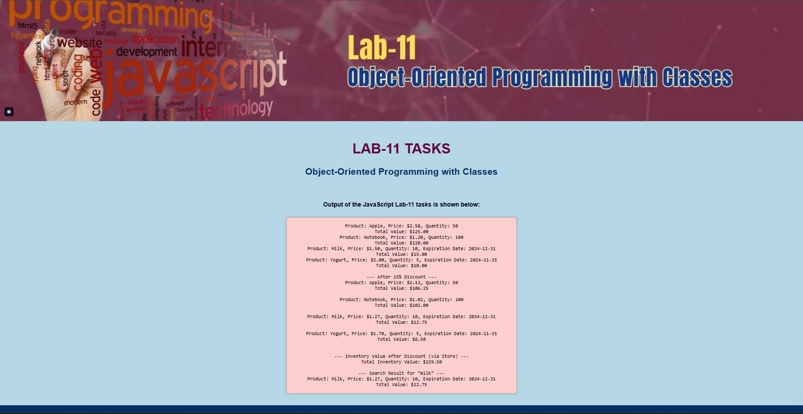

# Lab 11 – Object-Oriented Programming with Classes

This project was built as part of a JavaScript lab assignment to demonstrate object-oriented programming concepts such as classes, inheritance, static methods, and modular file structure.

## Summary

The application simulates a simple product inventory system using JavaScript classes. It includes regular products, perishable products with expiration dates, and a store that tracks inventory value and allows product searches. The output is displayed in the browser and the console.

## Features

- ProductProperties class with price and quantity
- PerishableProductProperties subclass with expiration date
- Static method to apply bulk discounts
- Store class to manage product inventory
- Live DOM output with a logOutput() helper function
- Case-insensitive product search
- Styled output in a responsive HTML page
- Fully modular JavaScript file structure
- 20+ Git commits with descriptive messages

## Live Demo

https://jamil-bk.github.io/lab11-inventory/

## File Structure
## File Structure

lab11-inventory/
├── index.html
├── styles.css
├── screenshot.png
├── README.md
├── .gitignore
├── js/
    ├── main.js
    ├── ProductProperties.js
    ├── PerishableProductProperties.js
    └── store.js

## Output Screenshot

Here is a preview of the application running in the browser:

